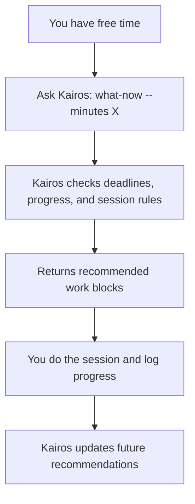
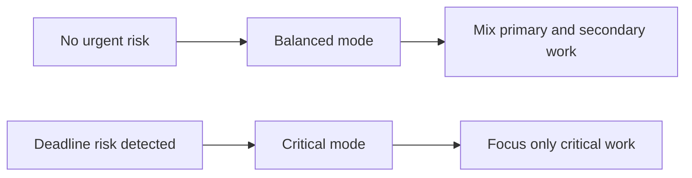

# Kairos

Kairos is a personal command-line planner that helps you decide what to work on right now.

It is built for one person managing multiple goals with deadlines. You tell Kairos how much time you have, and it suggests the best next work session.

## Who this is for

Kairos is for you if you:

- juggle multiple projects (study, fitness, writing, etc.)
- often ask yourself "What should I do with the next 30-90 minutes?"
- want guidance that balances deadlines and long-term consistency

## What Kairos does (in plain language)

- Tracks your projects and task progress
- Understands deadlines and workload risk
- Suggests a focused session when you run `what-now --minutes X`
- Explains why it made each recommendation
- Replans only when you ask (no noisy background auto-changes)

## Install and run the CLI

### Prerequisites

- Go 1.25+ installed
- macOS/Linux terminal

### 1) Install Kairos

From the project root:

```bash
make install
```

This installs `kairos` globally so you can run it from anywhere.

### 2) Point Kairos to local data and templates

For easiest local setup:

```bash
export KAIROS_DB="$PWD/.kairos/kairos.db"
export KAIROS_TEMPLATES="$PWD/templates"
```

### 3) Run it

```bash
kairos --help
kairos template list
```

## First-time walkthrough

Create a project from a template:

```bash
kairos project init \
  --id PHI01 \
  --template course_weekly_generic \
  --name "Philosophy 101" \
  --start 2026-02-07 \
  --due 2026-05-30 \
  --var weeks=12 \
  --var assignment_count=4
```

Check your projects:

```bash
kairos project list
kairos status
```

Ask what to do with your next 45 minutes:

```bash
kairos what-now --minutes 45
```

Log what you actually did:

```bash
kairos session log --work-item <WORK_ITEM_ID> --minutes 45 --units-done 1 --note "Focused reading"
```

## Starter templates

- `course_weekly_generic`: Course with weekly nodes, reading work, and assignment due dates.
- `self_paced_work_items`: Fixed number of work items (for example, `48` classes) with no forced schedule.
- `certification_exam_prep`: Weekly certification prep with quizzes, mock exams, and a final review block.
- `writing_project_stages`: Planning, chapter drafting, revision, and publishing workflow.
- `interview_prep_track`: DSA sets, system design sessions, behavioral prep, and final mock interview.
- `language_immersion_sprint`: Daily listening/reading/speaking blocks plus weekly review.
- `portfolio_milestones`: Milestone-based build tasks with demo and retrospective sessions.

## Simple mental model



## Example: real-life usage

### Example 1: "I have 45 minutes before dinner"

You run:

```bash
kairos what-now --minutes 45
```

Kairos may suggest:

- 30 min: OU module reading (due soon, slightly behind pace)
- 15 min: Calisthenics mobility block (safe secondary work)

Why this helps:

- You reduce deadline risk first
- You still keep momentum on a secondary goal

### Example 2: "Exam is near, I need to focus"

If one project becomes high-risk, Kairos switches to critical focus and may suggest only exam-related tasks until risk drops.



### Example 3: "Weekly reset"

At the start of the week, you check status and then ask for a work block:

```bash
kairos status
kairos what-now --minutes 60
```

Kairos shows which projects are:

- on track
- at risk
- critical

Then it gives a 60-minute recommendation aligned with that status.

## How recommendations stay practical

Kairos tries to avoid unrealistic plans by respecting session limits:

- minimum useful session length
- maximum session length
- whether a task can be split

So if a task needs at least 25 minutes, it will not suggest it in a 10-minute window.

## Importing a project from JSON

If you have a specific project plan (not a reusable template), you can import it directly from a JSON file:

```bash
kairos project import myproject.json
```

### JSON format

```json
{
  "project": {
    "short_id": "PHI01",
    "name": "Philosophy Essay",
    "domain": "education",
    "start_date": "2026-02-01",
    "target_date": "2026-05-01"
  },
  "defaults": {
    "duration_mode": "estimate",
    "session_policy": {
      "min_session_min": 15,
      "max_session_min": 60,
      "default_session_min": 30,
      "splittable": true
    }
  },
  "nodes": [
    {
      "ref": "ch1",
      "title": "Chapter 1: Introduction",
      "kind": "module",
      "order": 0
    },
    {
      "ref": "ch1_s1",
      "parent_ref": "ch1",
      "title": "Section 1.1",
      "kind": "section",
      "order": 0
    }
  ],
  "work_items": [
    {
      "ref": "ch1_s1_read",
      "node_ref": "ch1_s1",
      "title": "Read Section 1.1",
      "type": "reading",
      "planned_min": 45,
      "units": { "kind": "pages", "total": 20 }
    },
    {
      "ref": "ch1_s1_exercises",
      "node_ref": "ch1_s1",
      "title": "Exercises 1.1",
      "type": "assignment",
      "planned_min": 30
    }
  ],
  "dependencies": [
    {
      "predecessor_ref": "ch1_s1_read",
      "successor_ref": "ch1_s1_exercises"
    }
  ]
}
```

### Key points

- **`ref`** fields are local IDs within the file (not UUIDs). Kairos generates real IDs on import.
- **`parent_ref`** and **`node_ref`** cross-reference other `ref` values in the same file.
- **`defaults`** is optional. It sets project-wide session policy and duration mode so you don't repeat them on every work item.
- Nodes must be listed in order: parents before children.
- Omitted optional fields get sensible defaults (status `todo`, duration mode `estimate`, session bounds `15/60/30`, splittable `true`).

### Import vs templates

| | `project import` | `project init` |
|---|---|---|
| Use case | One-off project with specific tasks | Reusable pattern (e.g. "12-week course") |
| Variables/loops | No | Yes |
| Project metadata | Inside the JSON file | Passed via CLI flags |
| File location | Any path | Must be in templates directory |

## Core commands

```bash
kairos project add
kairos project init
kairos project import <file.json>
kairos work add
kairos session log
kairos status
kairos what-now --minutes 60
kairos replan
kairos template list
```

## Documentation map

- `docs/prd.md`: product behavior and rules
- `docs/contracts.md`: request/response contracts for `what-now`, `status`, `replan`
- `docs/orchestrator.md`: implementation workflow and quality gates

## Why "Kairos"?

In Greek, *kairos* refers to the right or opportune moment.

This project is about choosing the right work for the time you have now.
